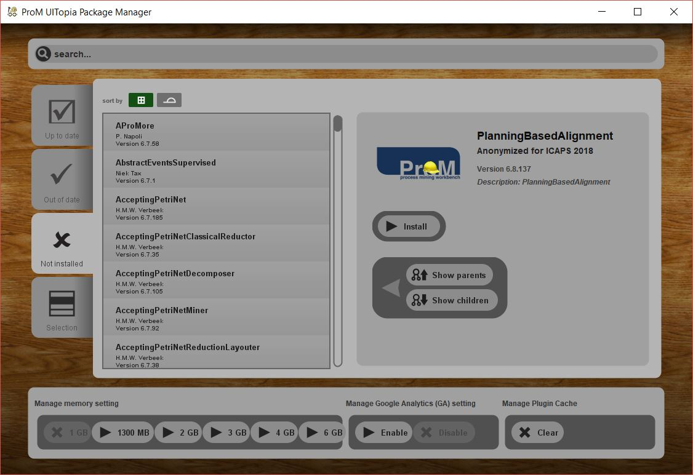
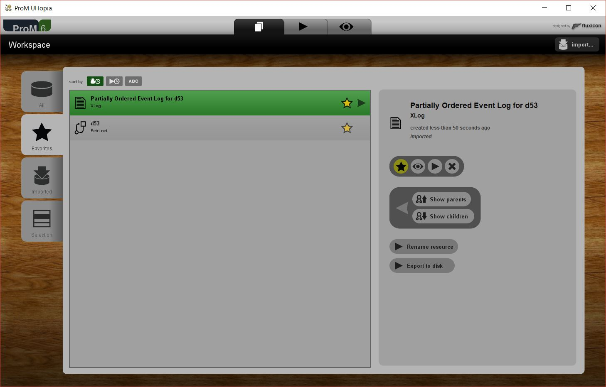
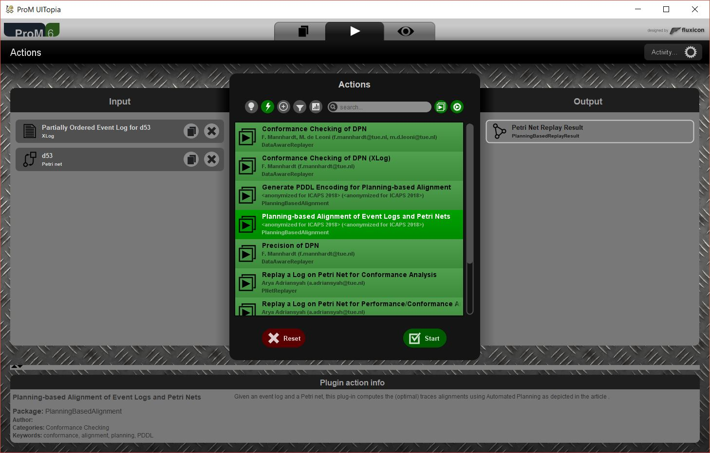
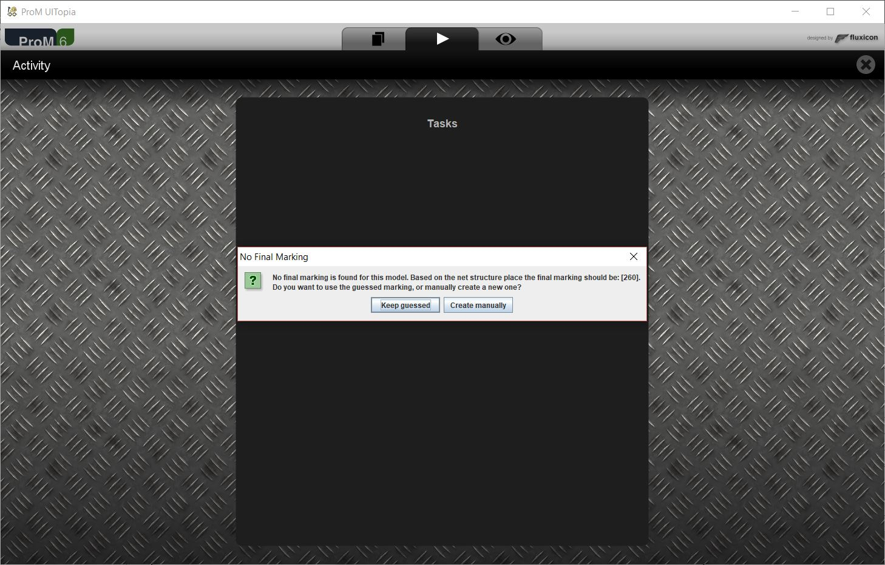
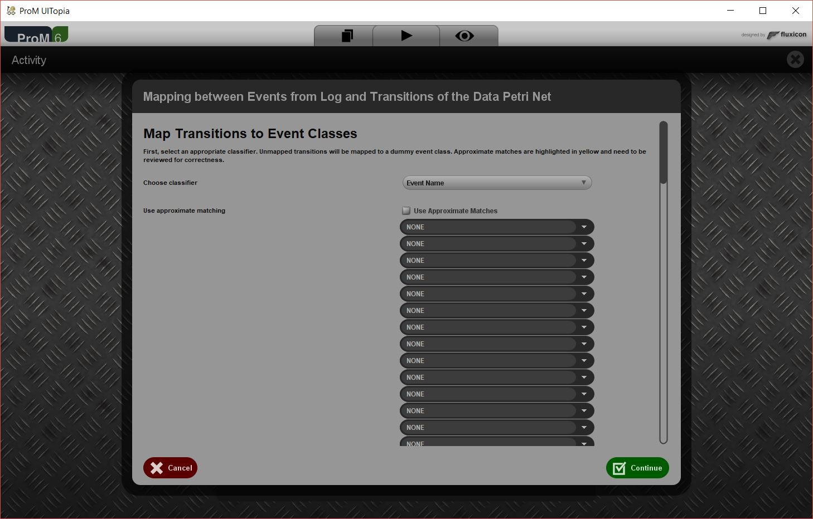
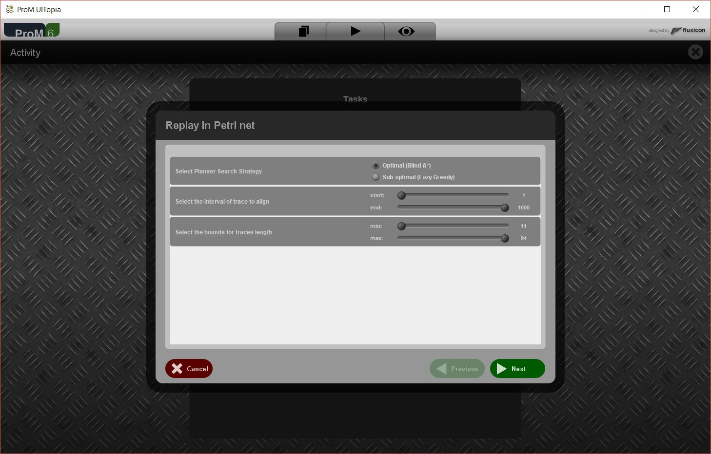
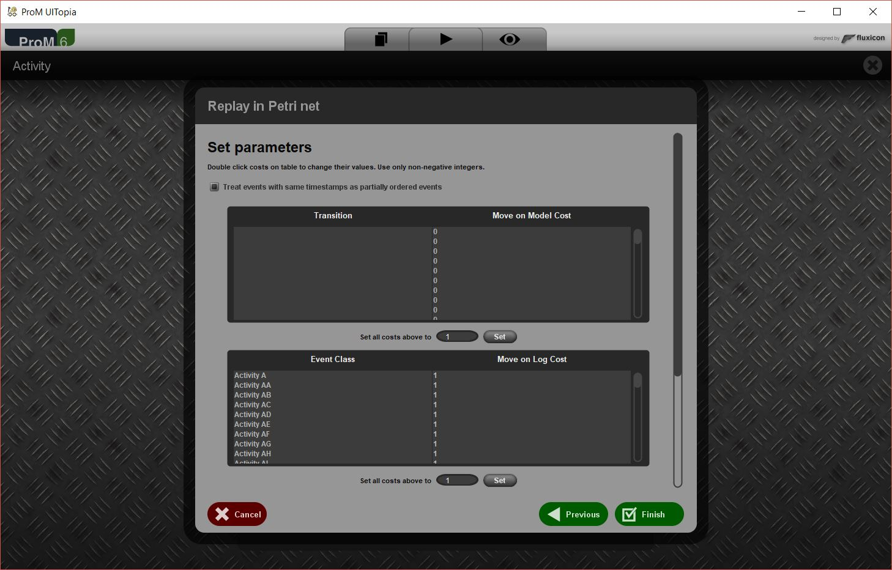
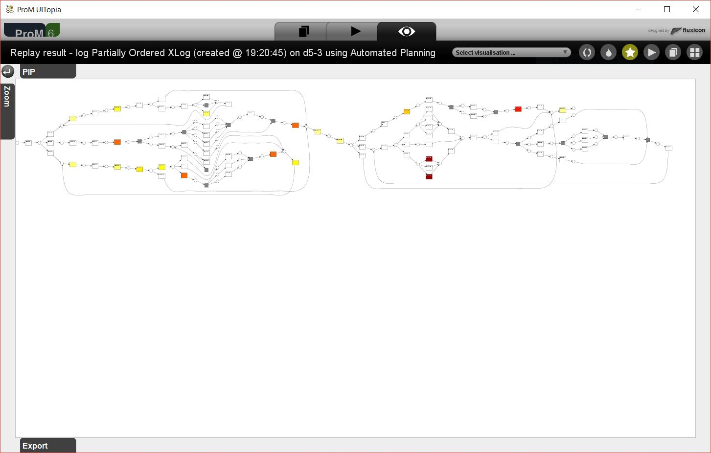
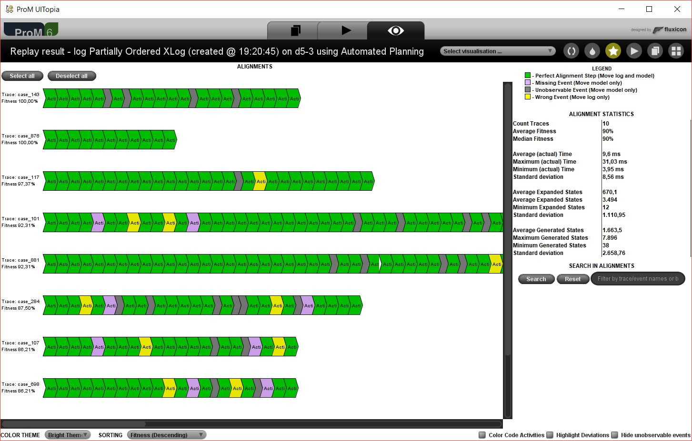

# PlanningBasedAlignment
Mirror of the official SVN repository of PlanningBasedAlignment package for ProM.

## User Instructions for "Planning-Based Alignment of Event Logs and Petri Nets" Plug-in
### Prerequisites
The tool for the planning-based alignment of partially-ordered event log traces and process models is available as a plug-in for **ProM**,
an established open-source framework for implementing Process Mining tools and algorithms. ProM **Nightly Builds** are available
at http://www.promtools.org/doku.php?id=nightly.

For the time being, the tool is guaranteed to work only on Windows.
However, Linux and Mac OS users can run the plug-in variant (described in *Exporting the PDDL Encodings*) that allows one to export the PDDL encodings
of the alignment problems, which can be used to feed any planner satisfying the assumptions provided in Section 2.3 of the paper 
*Aligning Partially-Ordered Process-Execution Traces and Models Using Automated Planning*. 
Furthermore, at https://goo.gl/F6n2Dh (in what follows, referred to as the *repository*) we provide the PDDL files used for the 
experiments described in the paper.
In order to run the tool, the following prerequisites must be satisfied:
- Having installed Java 1.7 or later versions (run `java -version` to check).
- Having installed either Python 2.7+ or Python 3.2+ (run `python -V` to check).

### Launching ProM Nightly Builds
Once ProM Nightly Builds are downloaded and unpacked, start *ProM Package Manager* to perform the initial configuration.
Depending on the operative system, choose the right executable between `PackageManager.bat` and `PackageManager.sh`.
 

The figure above shows the GUI that is presented after launching the package manager. Navigate to the "Not installed" 
tab and use the search bar to retrieve the "PlanningBasedAlignment" package from the list of available packages. 
Then, click on "Install" and wait for the completion. If the installation terminates with success, then the package should 
be visible in the list of the "Up to date" tab, together with the other packages it depends on.

It is now possible to start ProM to use the tool. Depending on the operative system, choose the right executable between 
`ProM.bat` and `ProM.sh`. The first start-up could take a while to complete, since some core components have to be loaded.

### Using the tool
Once ProM GUI is loaded, it is possible to align event logs and process models.
For instance, one can use the material available at our repository, by selecting one of the synthetic process models
(encoded in *.pnml* format) and one of its related event logs (encoded in *.xes.gz* format).
In order to test the tool, perform the following steps:

1. Import the Petri net representing the process model by drag-and-dropping the .pnml file into the GUI.
Then, select "PNML Petri net files" from the dropdown menu and confirm.

2. Import the event log by drag-and-dropping the .xes.gz (or .xes) file into the GUI. Then, select "ProM log files (XESLite - MapDB)"
from the dropdown menu and confirm. The figure below shows how ProM GUI should look like at this point. 
The imported resources are listed and ready to be given as input to the plug-in.
 

    
3. Select the Petri net and the event log from the list and click on the "play" button in the right column of the GUI.
In this way, one can define which resources have to be considered as inputs. The figure below shows how ProM GUI should 
look like at this point.
 

    
4. Select "Planning-Based Alignment of Event Logs and Petri Nets" from the list of available plug-ins and click "Start".
    
5. As shown in the figure below, the plug-in may ask for the definition of a final marking for the process model
(i.e. the token distribution that must be reached for the *replay* of the trace to be terminated), that is needed for
the definition of the goal state of the planning problem. The user is allowed to define the marking on its own, or let the 
program derive it automatically from the process model structure.
 

    
6. Select the suitable classifier from the dropdown list (cf. the figure below), in order to map each process activity to 
an event label. In the most of the cases, activities and events that are relates are also labelled with equal names and the 
"Event Name" classifier should work fine. In addition, the user is allowed to set the mapping individually for each activity,
in case the classifier does not map correctly. Then, click on "Continue".
 

7. Set the search strategy to be used by the planner in order to find the alignments. Currently, the tool supports two different 
strategies, that respectively yields to optimal (Blind A*) and sub-optimal (Lazy Greedy Best-First) solutions. In addition, 
one can also use the other settings to filter the log, in order to align only a subset of the traces. The figure below shows
the dialog that prompts the user for these settings. Then, click on "Next".
 

8. Set the costs for the possible alignment moves through the panel shown in the figure below. By default, synchronous moves 
and model moves related to invisible transitions have cost equal to 0, while non-synchronous moves have cost equal to 1. 
Although, the user is allowed to change the costs in order to define different degrees of non-conformity. In addition, 
one can also state whether a (possible) partial ordering in the traces must be taken into account. Then, click on "Finish".
 

Once the computation is terminated, the GUI presents to the user the results of the alignment of the event log onto the Petri net. 
The user can choose between two different views (by selecting the related entry in the dropdown menu in the top right corner):

- The projection of the occurred deviations onto the process model, where each activity is colored according to the degree of 
non-conformity observed in the event log (for that particular activity). The darker the color, the more severe is the deviation 
from the prescribed behaviour. The figure below shows such visualization of the result.
 

- The list of aligned traces, in which all the sequences of alignment moves (i.e. the plans found after executing the planner) 
are reported and the type of each move is highlighted. In addition, in the right part of the view, a statics report is shown. 
The figure below shows such visualization of the result.
 

### Exporting the PDDL Encodings
Despite the tool is integrate with the *Fast Downward* (http://www.fast-downward.org) 
planning framework, one could be interested in aligning the event log and the process model using a different planner,
for instance, to compare the performances of two different implementations of the same search strategy. For these reasons, 
we developed a small variant of the tool (also provided as a ProM plug-in) that only allows for the export of the PDDL encoding 
of the alignment problems.

The usage is analogous to the previous plug-in for steps 1-3 and 5-8. Conversely, at step 4, the user has to select the 
plug-in variant "Generate PDDL Encoding for Planning-Based Alignment". Then, at the end of the configuration steps, choose the 
destination directory for the PDDL files. These output files can now be given as inputs to any compatible planner, to get the 
plans representing the aligned traces.
